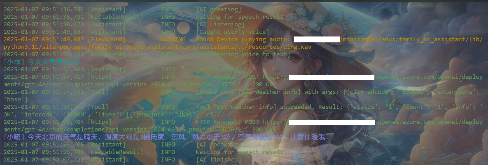
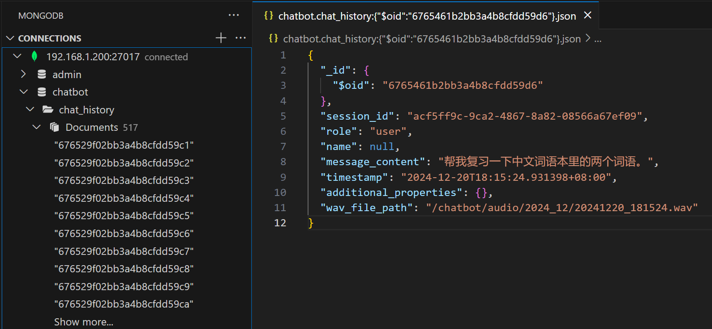
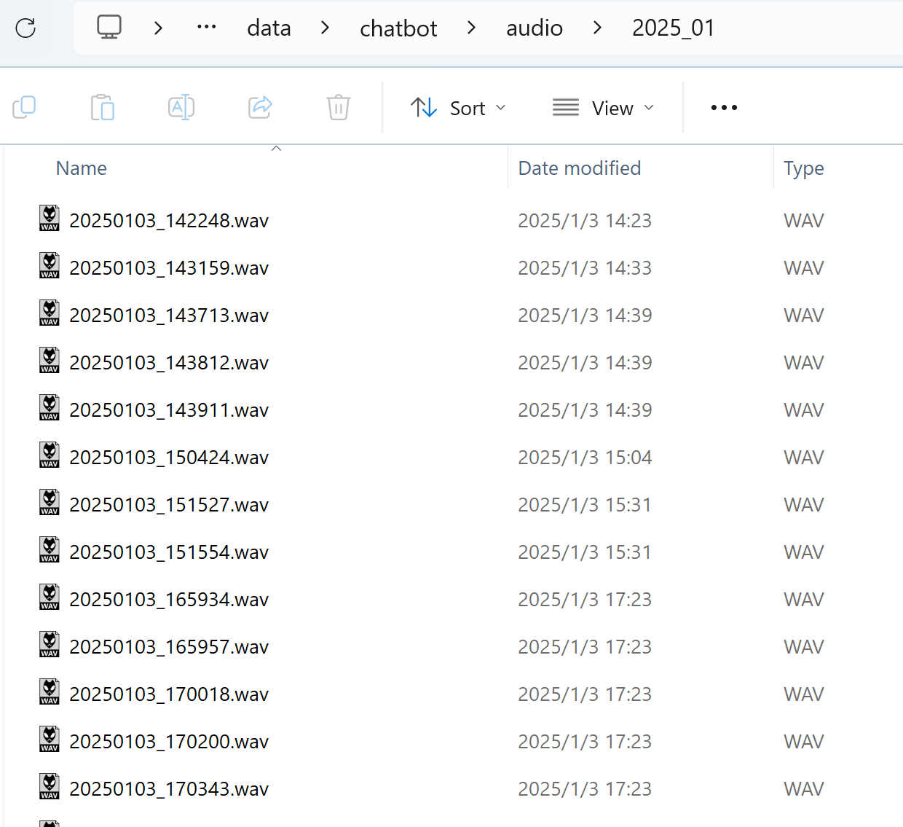
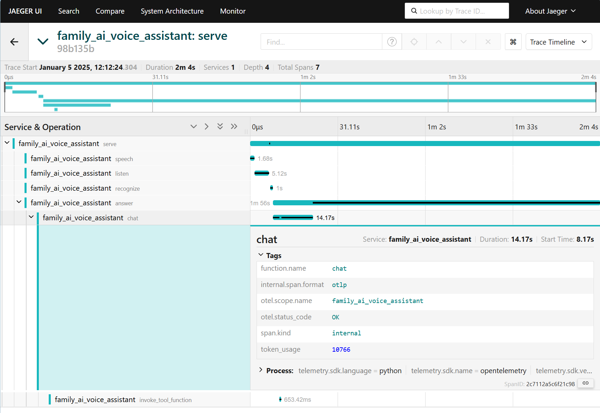

# Family AI Voice Assistant

## Project Overview

**Family AI Voice Assistant** is a home smart speaker program based on large models. It was developed as a smart voice assistant for my 6-year-old daughter, who cannot yet use phones and computers, to answer her curious questions in a way she can understand and to teach her knowledge. It also helps with learning, such as organizing and recording new vocabulary and assisting with regular reviews.

The project supports voice and keyboard activation and can call various large models. Tailored for home education environments, it includes tools like web search, vocabulary books, English speaking practice, memos, weather, timers, and alarms.

### Features

- **Modular Code**: Easily extendable to support different Speech-to-Text (STT), Text-to-Speech (TTS), and large model (LLM) implementations. Switch between options with customizable configuration files.
- **Convenient Tool Integration**: Directly integrate custom Python functions into the LLM's tool list.
- **Multiple Interactions**: Besides voice control, a REST API is provided for embedding into other applications.
- **Local Storage**: Local (on-device or intranet) storage for chat records and audio, capturing the child's curious thoughts and adorable voice.
- **Comprehensive Service Monitoring**: Provides logging and telemetry modules.

## Prerequisites

### Hardware Requirements

- **Audio Devices**: A microphone and speaker are needed. A conference mic and speaker combo is recommended for their compact size and wide range.
- **Server Host**: A low-power host or Raspberry Pi is recommended. If using local STT, TTS, and LLM solutions (e.g., OpenAI Whisper, Coqui TTS, Ollama), ensure appropriate GPU support. API solutions are recommended for model performance, call time, and cost.
- **Enter Key (Optional)**: More stable and reliable than open-source voice activation. A physical key is recommended for ease of use and to prevent accidental activation.

### Software Requirements

- **Operating System**: Linux is recommended. The embedded Snowboy voice activation supports only x86_64 and arm64 architectures on Linux.
- **Other Systems**: The project also supports macOS and Windows, but voice activation can only use Picovoice.

## Installation Guide

### Required System Libraries

- **Linux**:
  - Run the script `scripts/install_requirements.sh`.
  - Alternatively, install missing audio libraries when installing Python packages based on error messages.

- **Windows & macOS**:
  - Install missing audio libraries when installing Python packages based on error messages.

### Python Package Installation

1. Install core and tool packages:

   ```bash
   pip install family-ai-voice-assistant-core
   pip install family-ai-voice-assistant-tools
   ```

2. Install implementation packages (choose extensions as needed):

   ```bash
   pip install family-ai-voice-assistant-impl[pvporcupine, azure-speech, openai-whisper, openai, ollama, coqui-tts]
   ```

   > **Note**: When installing `family-ai-voice-assistant-impl`, choose extensions based on the solutions you use. Snowboy voice activation is a built-in feature.

### MongoDB Installation (Optional)

- Installing MongoDB is recommended. It is used for session records and some built-in tools. Refer to [Install MongoDB Community with Docker](https://www.mongodb.com/docs/manual/tutorial/install-mongodb-community-with-docker/) for quick deployment via Docker.

## Usage Instructions

### Program Configuration

1. **Customize Prompt**:
   - Customize your prompt based on usage needs using the template `configs/init_prompt.jinja`.
   - This prompt is loaded at the start of each chat session.

2. **Configuration File**:
   - Customize your `configs/config.yaml` based on the solutions you use and the module introductions below.
   - Note: The path to the customized prompt file from the previous step should be entered in the corresponding location in `config.yaml`.

### Program Startup

- Start the program with the following command:

  ```bash
  start_family_ai_voice_assistant PATH_TO_YOUR_CONFIG/config.yaml
  ```

- For long-term operation, register the program as a system service.

### Docker Execution

- Use the `Dockerfile` to build an image.
- When running the container, map audio devices (Linux only) or use Pulse Audio to access audio devices within the container.
  - If mapping audio devices, execute `scripts/generate_asoundrc.py` to generate `~/.asoundrc`, or configure the file manually.

> **Note**: Running via Docker is not recommended due to longer latency in voice interaction compared to direct execution.

## Module Introduction

### General

**Function**: Configure basic settings such as language, timezone, and user information.

- **Parameters**:
  - **language**: Set the assistant's prompt language (options: CHS, EN).
  - **timezone**: Specify timezone (e.g., Asia/Shanghai, refer to [List of tz database time zones](https://en.wikipedia.org/wiki/List_of_tz_database_time_zones)).
  - **bot_name**: Name of the assistant.
  - **user_name**: Name of the user.
  - **city**: Default city.

### Assistant API (Optional)

**Function**: Provide REST API services for integration with external systems. Refer to: [Assistant API](src/family-ai-voice-assistant-core/README.md#assistant-api)

- **Parameters**:
  - **port**: Port number for API service listening.

- **API Calls**:
  - Refer to [chat_request.py](src/family-ai-voice-assistant-core/family_ai_voice_assistant/core/contracts/chat_request.py)

### Wakers

**Function**: Configure methods to wake the assistant via voice or keyboard. Supports one voice and one keyboard wake method simultaneously. The keyboard wake method can also interrupt the assistant's voice playback. If no wake method is provided, use the command line with Enter for testing.

- **Choices**:
  - **Snowboy (Linux only)**:
    - Voice wake-up by listening for keywords.
    - For environment requirements and custom model configuration, refer to [snowboy](https://github.com/seasalt-ai/snowboy).
    - **Parameters**:
      - **model_path**: Path to the Snowboy model file. Use the built-in "snowboy" model if set to null.
  - **Picovoice**:
    - Voice wake-up by listening for keywords.
    - Based on Picovoice SDK version 2.2.0. Refer to [Picovoice Python](https://picovoice.ai/docs/quick-start/porcupine-python/) for language (.pv) and keyword (.ppn) model files.
    - **Parameters**:
      - **api_key**: Picovoice API key.
      - **model_path**: Path to the language model file.
      - **keyword_paths**: List of keyword model file paths.
  - **Keyboard (Linux only)**:
    - Listen for Enter key input to wake the assistant.
    - **Parameters**:
      - **device**: Path to the keyboard device, e.g., /dev/input/event1.

### Recognition

**Function**: Configure parameters for speech recognition after waking.

- **Choices**:
  - **SpeechRecognition**:
    - Refer to [Speech Recognition Library Reference](https://github.com/Uberi/speech_recognition/blob/master/reference/library-reference.rst) for parameter settings.
    - **Parameters**:
      - **timeout**: Timeout for recognition start.
      - **phrase_time_limit**: Maximum time for each recognition.
      - **energy_threshold**: Energy threshold.
      - **pause_threshold**: Pause threshold.

### STT (Speech-to-Text)

**Function**: Convert speech to text.

- **Choices**:
  - **Azure Speech**:
    - Refer to [What is the Speech service](https://learn.microsoft.com/en-us/azure/ai-services/speech-service/overview) to create an Azure Speech resource.
    - **Parameters**:
      - **api_key**: Azure API key.
      - **api_region**: Service region identifier. Refer to [Speech service supported regions](https://learn.microsoft.com/en-us/azure/ai-services/speech-service/regions#speech-service).
      - **voice**: Configure language and voice name. Refer to [Language and voice support for the Speech service](https://learn.microsoft.com/en-us/azure/ai-services/speech-service/language-support?tabs=stt#supported-languages). Set one Chinese and one English voice, e.g.:
        ```
          - language: zh-CN
            name: zh-CN-XiaoyiNeural
          - language: en-US
            name: en-US-AnaNeural
        ```
  - **OpenAI Whisper**:
    - Refer to [whisper](https://github.com/openai/whisper), pre-download the required model.
    - **Parameters**:
      - **model**: Model to use (e.g., turbo).

### TTS (Text-to-Speech)

**Function**: Convert text to speech.

- **Choices**:
  - **Azure Speech**: Shares configuration parameters with STT.
  - **Coqui TTS**:
    - Refer to [Coqui TTS](https://github.com/coqui-ai/TTS), pre-download the required model, and find the built-in pre-trained speaker ID or provide recordings for the speaker to clone (choose one).
    - **Parameters**:
      - **model**: TTS model path.
      - **speaker_id**: Built-in pre-trained speaker ID.
      - **speaker_wav**: Recording of the speaker to clone.

### Chat Session

**Function**: Manage chat session settings.

- **Parameters**:
  - **init_prompt_path**: Initial prompt file path, jinja file. Prepare according to [init_prompt.jinja](configs/init_prompt.jinja).
  - **max_token_per_session**: Maximum token count per session; exceeding this will automatically clear the session history. -1 means no token limit.
  - **session_timeout**: Session timeout (seconds). The maximum interval between Q&A; exceeding this starts a new session.

### LLM (Large Language Model)

**Function**: Configure the large language model to use.

- **Choices**:
  - **OpenAI**:
    - Choose any LLM compatible with the OpenAI Python SDK, such as [OpenAI](https://github.com/openai/openai-python), [Kimi](https://platform.moonshot.cn/docs/guide/start-using-kimi-api), [deepseek](https://api-docs.deepseek.com/), etc.
    - **Parameters**:
      - **api_key**: API key.
      - **api_base**: Enter the specified URL based on different providers, e.g., [https://api.deepseek.com](https://api.deepseek.com), [https://api.moonshot.cn/v1](https://api.moonshot.cn/v1). Use OpenAI's model if no api_base is provided.
      - **model**: Model name (e.g., gpt-4o).
  - **Azure OpenAI**:
    - Refer to [Azure OpenAI Service](https://azure.microsoft.com/en-us/products/ai-services/openai-service) to create an Azure OpenAI resource.
    - **Parameters**:
      - **api_key**: Azure API key.
      - **api_base**: API base URL.
      - **api_version**: API version.
      - **deployment_name**: Deployment name.
  - **Ollama**:
    - Refer to [Ollama](https://github.com/ollama/ollama), pre-download the required model on the local machine or another machine on the intranet.
    - **Parameters**:
      - **host**: Host address providing Ollama service.
      - **model**: Model name.

### Builtin Tools

**Function**: Configure databases and APIs for built-in tools. All parameters are optional. If a Builtin Tool is loaded in [Tools Manager](#tools-manager), provide the corresponding parameters. Refer to [Builtin Tools](src/family-ai-voice-assistant-tools/README.md#builtin-tools) for the list of Builtin Tools.

- **Parameters**:
  - **mongo_connection_str**: MongoDB connection string, used by multiple tools. E.g., mongodb://localhost:27017/
  - **mongo_database**: Database name.
  - **english_word_list_collection**: Collection for storing English vocabulary.
  - **chinese_phrase_list**: Collection for storing Chinese vocabulary.
  - **memo_list_collection: memo_list**: Collection for storing memos.
  - **google_search_api_key**: Google Search API key. Create a SerpApi account for the key, refer to [Google Search API](https://serpapi.com/).
  - **bing_subscription_key**: Bing Search API key. Create a Bing Search resource for the key, refer to [Bing Search API](https://www.microsoft.com/en-us/bing/apis#contentPanel).
  - **bing_search_endpoint**: Bing search endpoint URL, e.g., https://api.bing.microsoft.com/v7.0
  - **amap_api_key**: Amap API key. Create an Amap API service for the key, refer to [Amap Weather Query](https://lbs.amap.com/api/webservice/guide/api/weatherinfo).
  - **default_city_adcode**: Default city code for Amap. [City Code Table](https://a.amap.com/lbs/static/code_resource/AMap_adcode_citycode.zip)

### Tools Manager

**Function**: Manage Tools that LLM can call. Refer to [Tool Definition](src/family-ai-voice-assistant-tools/README_CN.md#tool-定义) to create custom Tools packages, or add custom Tools to family-ai-voice-assistant-tools. After adding, install the package in the current Python environment.

```bash
pip install YOUR_TOOLS_PACKAGE
```

- **Parameters**:
  - **packages**: List of tool packages to load. Enter the package namespace, e.g.:
    ```
    - family_ai_voice_assistant.tools
    ```
    If neither include_functions nor exclude_functions is specified, all methods with the @tool_function decorator in the package are loaded. Note: For Builtin Tools, choose either Google or Bing for the search tool. Bing's search includes multiple tool methods.
  - **include_functions (optional)**: List of tool method names to load. Methods not in the list will not be loaded.
  - **exclude_functions (optional)**: List of tool method names to exclude. Methods not in the list will be loaded.

### Logging (Optional)

**Function**: Configure logging.

- **Parameters**:
  - **level**: Log level (e.g., INFO).
  - **path**: Path to the log file.



### History Store (Optional)

**Function**: Configure chat history storage.

- **Parameters**:
  - **connection_str**: Currently supports only MongoDB, connection string, e.g., mongodb://localhost:27017/
  - **database_name**: Database name.
  - **collection_name**: Chat history collection name.



### File Store (Optional)

**Function**: Manage the storage location of audio files.

- **Parameters**:
  - **destination**: Can be:
    - Local file storage path
    - File storage API (deployed on an intranet file storage server, such as NAS). E.g., [http://192.168.1.200:5100/files/upload](http://192.168.1.200:5100/files/upload) (refer to [File Server](src/family-ai-voice-assistant-core/README.md#file-server) to set up a file server)



### Telemetry (Optional)

**Function**: Configure telemetry data export. Built-in OpenTelemetry tracing records, supporting OTLP endpoint export. Refer to [Open Telemetry Collector](https://opentelemetry.io/docs/collector/) to choose a suitable collector, such as [Jaeger](https://www.jaegertracing.io/).

- **Parameters**:
  - **exporter_type**: Export type, grpc, http, console.
  - **endpoint**: Telemetry data endpoint, e.g., 192.168.1.100:4317




## License

This project is licensed under the MIT License - see the [LICENSE](LICENSE) file for details.
