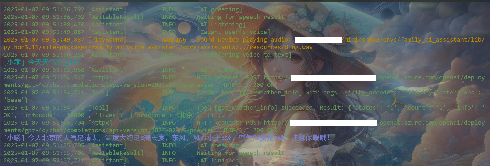
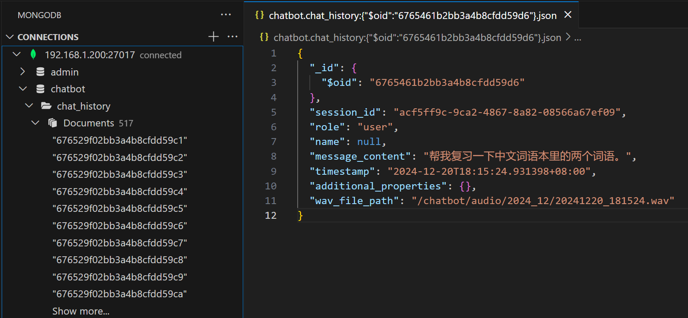
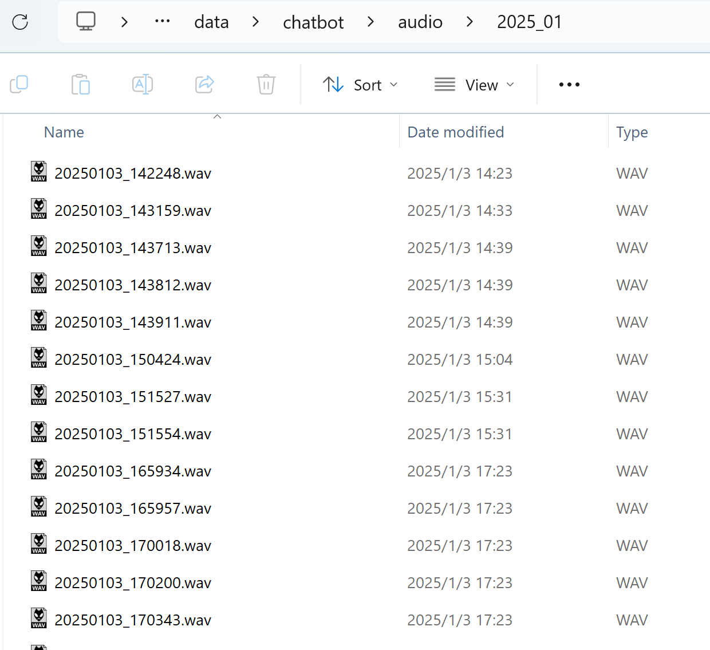

# Family AI Voice Assistant

## 项目简介

**Family AI Voice Assistant** 是一个基于大模型的家庭智能音箱程序。开发的初衷，是为还不能使用手机和电脑的6岁女儿做一个智能的语音助手，用她能听懂的方式，回答她各种奇思妙想的问题，并给她讲一些知识。同时还可以做一些学习的辅助，比如随时整理记录学到的新的词汇，并帮她做定期的复习。

该项目支持语音和键盘唤醒，并可调用多种大模型。针对家庭教育环境，内置了多种工具功能，如网页搜索、单词本、英文口语练习、备忘录、天气、计时器和闹钟等。

### 特色

- **模块化代码**：可以轻松扩展以支持不同的语音识别(STT)、语音合成(TTS)和大模型(LLM)实现方案。通过定制化配置文件，在不同方案中切换。
- **便捷的工具调用扩展**：可直接将自定义 Python 函数接入 LLM 的工具列表。
- **多种交互**：除了语音控制，还提供了调用智能音箱进行chat的REST API，方便嵌入到其它应用程序中。
- **本地化存储**：提供本地化（本机或内网）的聊天记录和录音存储功能，记录孩子成长过程中的奇思妙想和可爱声音。
- **完善的服务监控**：提供日志记录和遥测模块。


## 前置条件

### 硬件需求

- **音频设备**：需要麦克风和音箱。推荐使用会议用的收音功放一体设备，这种设备小巧且收音范围广。
- **服务器主机**：建议使用低功耗主机或树莓派等开发板。如果使用本地化的 STT、TTS 和 LLM 解决方案（如 OpenAI Whisper、Coqui TTS、Ollama），需要根据模型要求提供相应的显卡支持。但考虑到模型效果、调用时间和使用成本，推荐使用API调用方案。
- **回车键（可选）**：相比开源免费的语音唤醒方案，物理按键唤醒更加稳定可靠。推荐使用解压用的回车键，方便孩子使用且不易误触。

### 软件需求

- **操作系统**：推荐使用 Linux 系统。内嵌的 Snowboy 语音唤醒仅支持 Linux 的 x86_64 和 arm64 架构。
- **其他系统支持**：项目也支持 macOS 和 Windows，但语音唤醒功能只能选择使用 Picovoice。


## 安装指南

### 必要的系统库

- **Linux**:
  - 执行脚本 `scripts/install_requirements.sh`。
  - 或者在安装 Python 包时，根据报错信息安装缺少的音频库。

- **Windows & macOS**:
  - 在安装 Python 包时，根据报错信息安装缺少的音频库。

### Python 包安装

1. 安装核心包和工具包：

   ```bash
   pip install family-ai-voice-assistant-core
   pip install family-ai-voice-assistant-tools
   ```

2. 安装实现包（根据需求选择扩展）：

   ```bash
   pip install 'family-ai-voice-assistant-impl[pvporcupine, azure-speech, openai-whisper, openai, ollama, coqui-tts]'
   ```

   > **注意**: 安装 `family-ai-voice-assistant-impl` 时，请根据实际使用的解决方案选择对应的扩展。Snowboy 的语音唤醒方案为内置功能。例如，选择 azure-speech 作为 STT 和 TTS 的实现，选择 openai 作为 LLM 的实现时:

      ```bash
      pip install 'family-ai-voice-assistant-impl[azure-speech, openai]'
      ```

   > **注意**: coqui-tts 要求 python < 3.12  [coqui-ai/tts installation](https://github.com/coqui-ai/TTS#installation)
  

### Mongo DB 安装 (Optional)

- 建议安装MongoDB。会话记录以及部分内置tools的存储使用MongoDB。可参照 [Install MongoDB Community with Docker](https://www.mongodb.com/docs/manual/tutorial/install-mongodb-community-with-docker/) 通过docker快速部署MongoDB服务。

## 使用说明

### 程序配置

1. **定制 Prompt**:
   - 根据使用需求，参考模板 `configs/init_prompt.jinja`，定制自己的 prompt。
   - 该 prompt 会在每个聊天会话开始时被加载。

2. **配置文件**:
   - 根据实际使用的解决方案以及后续各模块的介绍，参考模板 `configs/config.yaml`，定制自己的 `configs/config.yaml`。
   - 注意：前一步定制化的 prompt 文件路径需要填入 `config.yaml` 的对应位置。

### 程序启动

- 使用以下命令启动程序：

  ```bash
  start_family_ai_voice_assistant PATH_TO_YOUR_CONFIG/config.yaml
  ```

- 如果需要长期运行该程序，可以将其注册为系统服务。

### Docker 运行

- 可以通过 `Dockerfile` 进行镜像构建。
- 运行容器时，需要映射音频设备（仅限 Linux）或者使用 Pulse Audio 使容器内部可以访问音频设备。
  - 如选择映射音频设备，需执行 `scripts/generate_asoundrc.py` 来生成 `~/.asoundrc`，或者自行配置该文件。

> **注意**: 不推荐通过 Docker 运行，实测语音交互相比直接运行有更长的延迟。


## 模块介绍

### General

**功能**: 配置程序的基本设置，如语言、时区和用户信息。

- **参数**:
  - **language**: 设置助手提示语言（选项：CHS, EN）。
  - **timezone**: 指定时区（例如：Asia/Shanghai，参照 [List of tz database time zones](https://en.wikipedia.org/wiki/List_of_tz_database_time_zones)）。
  - **bot_name**: 助手的名称。
  - **user_name**: 用户的名称。
  - **city**: 默认城市。

### Assistant API (Optional)

**功能**: 提供 REST API 服务以便与外部系统集成。参考：[Assistant API](src/family-ai-voice-assistant-core/README_CN.md#assistant-api)

- **参数**:
  - **port**: API 服务监听的端口号。

- **调用接口**:
  - 参照 [chat_request.py](src/family-ai-voice-assistant-core/family_ai_voice_assistant/core/contracts/chat_request.py)


### Wakers

**功能**: 配置语音或键盘唤醒助手的方式。可同时提供一个语音唤醒和一个键盘唤醒方式。其中键盘唤醒还可以用作打断助手语音的播放。如果没有提供任何唤醒方式，则使用命令行交互键入回车的方式进行唤醒（用于测试）。

- **选择**:
  - **Snowboy (Linux only)**:
    - 监听关键词的语音唤醒
    - 环境需求以及自定义模型配置，请参照 [snowboy](https://github.com/seasalt-ai/snowboy)。
    - **参数**:
      - **model_path**: Snowboy 模型文件路径。填入null时，使用内置提示词为"snowboy"的模型
  - **Picovoice**:
    - 监听关键词的语音唤醒
    - 基于Picovoice 2.2.0版本SDK。参照 [Picovoice Python](https://picovoice.ai/docs/quick-start/porcupine-python/) 提供语言(.pv)和关键词(.ppn)模型文件
    - **参数**:
      - **api_key**: Picovoice 的 API 密钥。
      - **model_path**: 语言模型文件路径。
      - **keyword_paths**: 关键词模型文件路径列表。
  - **Keyboard (Linux only)**:
    - 监听键盘回车键的输入以唤醒助手
    - **参数**:
      - **device**: 键盘设备路径。例如： /dev/input/event1

### Recognition

**功能**: 配置唤醒后语音识别的参数。

- **选择**:
  - **SpeechRecognition**:
    - 参照 [Speech Recognition Library Reference](https://github.com/Uberi/speech_recognition/blob/master/reference/library-reference.rst) 进行参数设置
    - **参数**:
      - **timeout**: 识别起始超时时间。
      - **phrase_time_limit**: 每次识别的最长时间。
      - **energy_threshold**: 能量阈值。
      - **pause_threshold**: 暂停阈值。

### STT (Speech-to-Text)

**功能**: 将语音转换为文本。

- **选择**:
  - **Azure Speech**:
    - 参照 [What is the Speech service](https://learn.microsoft.com/en-us/azure/ai-services/speech-service/overview) 创建Azure Speech的resource。
    - **参数**:
      - **api_key**: Azure 的 API 密钥。
      - **api_region**: 服务区域的identifier。参照 [Speech service supported regions](https://learn.microsoft.com/en-us/azure/ai-services/speech-service/regions#speech-service)
      - **voice**: 配置language和声音的name。参照 [Language and voice support for the Speech service](https://learn.microsoft.com/en-us/azure/ai-services/speech-service/language-support?tabs=stt#supported-languages)。 需设置一个中文和一个英文语音。例如:
        ```
          - language: zh-CN
            name: zh-CN-XiaoyiNeural
          - language: en-US
            name: en-US-AnaNeural
        ```
  - **OpenAI Whisper**:
    - 参照 [whisper](https://github.com/openai/whisper) , 预先下载好需要的模型
    - **参数**:
      - **model**: 使用的模型（例如：turbo）。

### TTS (Text-to-Speech)

**功能**: 将文本转换为语音。

- **选择**:
  - **Azure Speech**: 与STT共用配置参数
  - **Coqui TTS**:
    - 参照 [Coqui TTS](https://github.com/coqui-ai/TTS) , 预先下载好需要的模型, 并查找到模型内置预训练的speaker ID或者提供需要clone的speaker的录音 (二选一)。
    - **参数**:
      - **model**: TTS 模型路径。
      - **speaker_id**: 内置预训练的speaker ID。
      - **speaker_wav**: 需要clone的speaker的录音。

### Chat Session

**功能**: 管理聊天会话的设置。

- **参数**:
  - **init_prompt_path**: 初始提示文件路径, jinja文件。参照 [init_prompt.jinja](configs/init_prompt.jinja) 进行准备。
  - **max_token_per_session**: 每个会话的最大 token 数量, 超出后该会话将自动清楚历史记录。-1表示不对token进行限制。
  - **session_timeout**: 会话超时时间（秒）。两次问答的最大间隔时间，超出该时间，则开启新的会话。

### LLM (Large Language Model)

**功能**: 配置使用的大型语言模型。

- **选择**:
  - **OpenAI**:
    - 可选择任一兼容OpenAI Python SDK的LLM， 如[OpenAI](https://github.com/openai/openai-python)， [Kimi](https://platform.moonshot.cn/docs/guide/start-using-kimi-api)，[deepseek](https://api-docs.deepseek.com/) 等。
    - **参数**:
      - **api_key**: API 密钥。
      - **api_base**: 根据不同供应商，填入指定的url，例如： [https://api.deepseek.com](https://api.deepseek.com)， [https://api.moonshot.cn/v1](https://api.moonshot.cn/v1)。不提供api_base时，使用OpenAI的模型。
      - **model**: 模型名称（例如：gpt-4o）。
  - **Azure OpenAI**:
    - 参照 [Azure OpenAI Service](https://azure.microsoft.com/en-us/products/ai-services/openai-service) 创建Azure OpenAI的resource。
    - **参数**:
      - **api_key**: Azure 的 API 密钥。
      - **api_base**: API 基础 URL。
      - **api_version**: API 版本。
      - **deployment_name**: 部署名称。
  - **Ollama**:
    - 参照 [Ollama](https://github.com/ollama/ollama) ， 在本机或者内网其它机器上预先下载好需要的模型。
    - **参数**:
      - **host**: 提供Ollama服务的主机地址。
      - **model**: 模型名称。

### Builtin Tools

**功能**: 配置内置工具的数据库和 API。皆为可选参数。如果在 [Tools Manager](#tools-manager) 中加载了某个 Builtin Tool，则需提供对应的参数。Builtin Tool的列表参考： [Builtin Tools](src/family-ai-voice-assistant-tools/README_CN.md#builtin-tools)

- **参数**:
  - **mongo_connection_str**: MongoDB 连接字符串，被多个tool使用。例如: mongodb://localhost:27017/
  - **mongo_database**: 数据库名称。
  - **english_word_list_collection**: 存储英语生词本的collection
  - **chinese_phrase_list**: 存储中文生词本的collection
  - **memo_list_collection: memo_list**:  存储备忘录的collection
  - **google_search_api_key**: Google 搜索 API 密钥。参照 [Google Search API](https://serpapi.com/) 创建SerpApi账号，获取秘钥
  - **bing_subscription_key**:Bing 搜索 API 密钥。参照 [Bing Search API](https://www.microsoft.com/en-us/bing/apis#contentPanel) 创建 Bing Search 的resource，获取秘钥
  - **bing_search_endpoint**: Bing 搜索的 endpoint url，例如： https://api.bing.microsoft.com/v7.0
  - **amap_api_key**: 高德地图 API 密钥。参照 [高德天气查询](https://lbs.amap.com/api/webservice/guide/api/weatherinfo) 创建高德 API 服务， 获取秘钥
  - **default_city_adcode**: 高德地图默认城市代码。[城市编码表](https://a.amap.com/lbs/static/code_resource/AMap_adcode_citycode.zip)

### Tools Manager
 
**功能**: 管理LLM可以调用的Tools。可以参照 [Tool 定义](src/family-ai-voice-assistant-tools/README_CN.md#tool-定义) 创建自定义的Tools包，也可以在 family-ai-voice-assistant-tools 里添加自定义的Tools。添加完成后，需使用将包安装到当前python环境。
```bash
pip install YOUR_TOOLS_PACKAGE
```

- **参数**:
  - **packages**: 需要加载的工具包列表。填入包的命名空间。例如：
    ```
    - family_ai_voice_assistant.tools
    ```
    如果没有指明 include_functions 或者 exclude_functions ，则加载所有包内所有带@tool_function装饰器的方法。注意： Builtin Tools包中的搜索Tool，请从 Google 和 Bing 中选择一种。其中 Bing 的搜索包含多个 Tool 方法。
  - **include_functions (optional)**: 需要加载的tool方法的名称列表。不在列表中的tool方法不会加载。
  - **exclude_functions (optional)**: 需要排除的tool方法的名称列表。不在列表中的tool方法都会加载。

### Logging (Optional)

**功能**: 配置日志记录。

- **参数**:
  - **level**: 日志级别（例如：INFO）。
  - **path**: 日志文件路径。



### History Store (Optional)

**功能**: 配置聊天历史存储。

- **参数**:
  - **connection_str**: 暂时只支持MongoDB，连接字符串。例如：mongodb://localhost:27017/
  - **database_name**: 数据库名称。
  - **collection_name**: 聊天历史集合名称。



### File Store (Optional)

**功能**: 管理录音文件存储位置。

- **参数**:
  - **destination**: 可以是：
    - 本地文件存储路径
    - 文件存储 API（部署在内网文件存储服务器，比如NAS）。例如： [http://192.168.1.200:5100/files/upload](http://192.168.1.200:5100/files/upload) (请参照 [File Server](src/family-ai-voice-assistant-core/README_CN.md#file-server) 搭建文件服务器)



### Telemetry (Optional)

**功能**: 配置遥测数据的导出。内置Open Telemetry的tracing记录，支持OTLP endpoint的导出。请参照 [Open Telemetry Collector](https://opentelemetry.io/docs/collector/) 选择合适的collector，例如 [Jaeger](https://www.jaegertracing.io/)。

- **参数**:
  - **exporter_type**: 导出类型, grpc, http, concole。
  - **endpoint**: 遥测数据终端点。例如: 192.168.1.100:4317


## 许可证

此项目基于 MIT 许可证授权。详细信息请参阅 [LICENSE](LICENSE) 文件。
