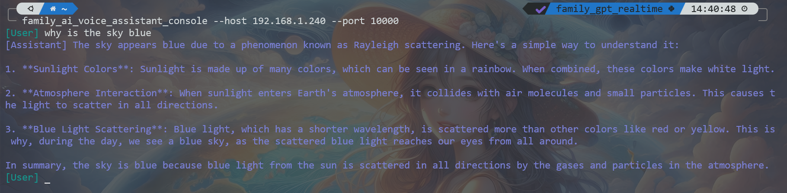

# Family AI Voice Assistant Core

## 项目简介

**Family AI Voice Assistant Core** 是一个基于大型语言模型（LLM）的家庭智能音箱核心库。该项目提供了一个模块化的解决方案，支持家庭语音助手的开发和部署。它提供了运行框架、模块接口定义，以及Tools Manager、logging和Telemetry等功能。

## 设计思路

项目采用模块化设计，旨在实现灵活的功能扩展和维护。通过定义清晰的接口，各模块可以独立开发，并通过配置文件进行动态加载和绑定。核心库负责协调各模块的交互，确保系统的稳定运行。

## 主体架构


### 各模块介绍

`clients` 目录下定义了智能音箱各功能模块的抽象接口：

- **AssistantClient**: 智能音箱的核心控制逻辑，实现了各模块的协调和调用。
- **WakerClient**: 唤醒检测接口，用于激活语音助手。
- **GreetingClient**: 负责生成问候语。
- **ListeningClient**: 负责监听用户的语音输入。
- **RecognitionClient**: 语音识别接口，将语音转换为文本。
- **PlaySoundClient**: 播放音频文件。
- **LLMClient**: 处理自然语言生成任务。
- **ChatSessionClient**: 管理与用户的对话会话，负责对话状态的维护。
- **SpeechClient**: 文本转语音接口，实现语音输出。
- **ClientManager**: Client管理器，负责各模块实例的注册和获取。
- **HistoryStoreClient**: 管理对话历史的存储。
- **FileStoreClient**: 文件存储接口，用于存储音频文件到指定位置。


### 其它功能

#### Logging

提供统一的日志记录功能，方便调试和系统监控。

#### Telemetry

负责系统性能和使用情况的监控，提供关键指标的收集和分析。

#### Tools Engine

位LLM管理和注册Tools Calling，支持动态扩展和调用。

#### Configs

配置管理模块，提供从配置文件加载和解析配置信息的功能，支持动态配置客户端和功能模块。

## 使用指南

### 环境准备

1. **python**: 确保安装了Python 3.9或以上版本，或用conda创建python环境。
2. **安装包文件**: 

```bash

pip install family-ai-voice-assistant-core

```

### 示例代码

可以直接使用family-ai-voice-assistant-impl，该项目提供了各模块的一些常用实现。或参照该项目定制化自己的实现。

具体步骤：

1. 实现以下接口：
    - VoiceWaker （optional, 内置键盘唤醒和交互式回车唤醒）
    - PlaySoundClient
    - RecognitionClient
    - LLMClient
    - SpeechClient

例如：

```python

from dataclasses import dataclass

from family_ai_voice_assistant.core.clients import VoiceWaker
from family_ai_voice_assistant.core.configs import ConfigManager
from family_ai_voice_assistant.core.configs import Config


@dataclass
class MyWakerConfig(Config):
    api_key: str = None


class MyWaker(VoiceWaker):

    def __init__(self):
        config = ConfigManager().get_instance(MyWakerConfig)
        if config is None:
            raise ValueError("MyWakerConfig is not set.")
        waker = WakerAPI(config.api_key)

    def check(self) -> bool:
        return waker.wake()

```

2. [optional] 对于新实现的每个client，定义出对应的config类型。可参照现有config类型 [/configs](family_ai_voice_assistant/core/configs/)。每个config类型会在解析时对应到config.yaml里的一个同名section。

3. 提供config.yaml文件，包含运行各模块的必要信息，并设置config.yaml的路径

config.yaml

```yaml

# 其它sections

mywaker:
  api_key: xxxxxx

# 其它sections

```

main.py

```python

from family_ai_voice_assistant.core import set_yaml_config_path

set_yaml_config_path("config.yaml")

```

4. 使用ClientSelector将client类型和config类型进行绑定。如果不需要config，则map到None。

```python

from family_ai_voice_assistant.core.client_register import (
    ClientSelector
)

ClientSelector().map_play_sound_config(None, MyPlaySound)
ClientSelector().map_voice_waker_config(MyVoiceWakerConfig, MyVoiceWaker)
ClientSelector().map_recognition_config(MyRecognitionConfig, MyRecognition) 
ClientSelector().map_llm_config(MyLLMConfig, MyLLM)
ClientSelector().map_speech_config(MySpeechConfig, MySpeech)

```

5. 使用ClientRegistor，通过读取config.yaml，来识别到需要实例化哪些client注册到ClientManager

```python

from family_ai_voice_assistant.core.client_register import (
    ClientRegistor,
    ClientSelector
)

ClientRegistor().register_clients_from_selector()

```

6. 运行assistant。assistant作为orchestrator，在运行时会从ClientManager中获取每个模块的实例，并调用相应的接口。

```python

assistant = ClientRegistor().get_assistant()
assistant.run()

```

以下是一个简单的启动示例

main.py

```python
import argparse
from family_ai_voice_assistant.core import set_yaml_config_path
from family_ai_voice_assistant.core.client_register import (
    ClientRegistor,
    ClientSelector
)

parser = argparse.ArgumentParser(description="Start the Family AI Assistant.")
parser.add_argument('config', type=str, help='the config file path')
args = parser.parse_args()

set_yaml_config_path(args.config)

def map_configs_to_clients():
    ClientSelector().map_play_sound_config(None, MyPlaySound)
    ClientSelector().map_voice_waker_config(MyVoiceWakerConfig, MyVoiceWaker)
    ClientSelector().map_recognition_config(MyRecognitionConfig, MyRecognition) 
    ClientSelector().map_llm_config(MyLLMConfig, MyLLM)
    ClientSelector().map_speech_config(MySpeechConfig, MySpeech)

def main():
    map_configs_to_clients()
    ClientRegistor().register_clients_from_selector()
    assistant = ClientRegistor().get_assistant()
    assistant.run()

if __name__ == "__main__":
    main()
```

执行：
```bash

python main.py <config.yaml路径>

```

真实的例子，可以参考 family-ai-voice-assistant-impl 的入口代码 [basic_entry.py](../family-ai-voice-assistant-impl/family_ai_voice_assistant/basic_entry.py)


## 其它功能

### File Server

命令 family_ai_voice_assistant_file_server， 可以启动接收上传文件的服务，用于部署在内网存储服务器上，如NAS。用以接收和存储音频文件。可以与内置的RestFileStore配合使用。

例如：

NAS side, ip: 192.168.1.200 

```bash

pip install family-ai-voice-assistant-core

family_ai_voice_assistant_file_server --root /home/username/data/assistant --port 5100 &

```

Assistant side

config.yaml

```yaml

filestore:
  destination: http://192.168.1.200:5100/files/upload

```

### Assistant API

内置两个Assistant的实现。默认为BasicAssistant。而AssistantWithApi则在BasicAssistant基础上，提供可以与Assistant进行chat的API，方便把Assistant嵌入到其它应用程序中。

例如：

Assistant side， ip: 192.168.1.240

config.yaml

```yaml

assistantapi:
  port: 10000 # any available port

```

在client端， 根据协议：[chat_request.py](family_ai_voice_assistant/core/contracts/chat_request.py) 调用该API，

```bash

curl -X POST -H "Content-Type: application/json" \
     -d '{"question": "天空为什么是蓝色的", "speak_answer": false}'  \
     http://192.168.1.240:10000/chat

```

或使用内置命令行交互式client：

```bash

pip install family-ai-voice-assistant-core

family_ai_voice_assistant_console --host 192.168.1.240 --port 10000 [--speak]

```

