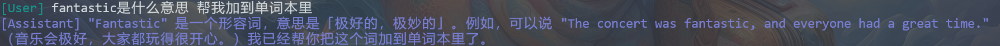

# Family AI Voice Assistant Tools

Family AI Voice Assistant Tools 是一个为 Family AI Voice Assistant 提供Builtin Tools的包，旨在为大型语言模型提供Tools Calling。该包提供了搜索、获取当前时间、天气信息以及收集中英文新词汇等功能以用于教育目的。注意，词汇收集功能需要 MongoDB 支持。也作为自定义Tools包的参考。

## 要求

- Python 3.9 或更高版本
- [可选] MongoDB 用于词汇功能

## Tool 定义

要定义一个Tool，请按照以下步骤操作：

### 1. Tool 装饰器：`@tool_function`

`@tool_function` 装饰器是注册一个函数为Tool的关键。它通知tool manager将该函数识别为可由 LLM 调用的Tool。

```python
from family_ai_voice_assistant.core.tools_engine import (
    tool_function
)
```

### 2. 函数定义

将您的Tool定义为标准 Python 函数。确保函数名称能描述其目的。使用 Python 类型注解参数和返回值，因为tool manager使用这些来确定参数类型。

### 3. 文档字符串

Tool的文档字符串至关重要。它有多个用途：
- **描述**：以简要描述Tool的功能开始。
- **参数**：描述每个参数。tool manager使用此信息来理解每个参数的作用。使用格式 `:param <name>: <description>`。

### 示例

以下是如何定义Tool的示例：

```python
@tool_function
def example_tool(param1: str, param2: int) -> Dict:
    """
    执行一个示例操作。

    :param param1: 第一个参数的描述。
    :param param2: 第二个参数的描述。
    """

    # Tool实现

    return {"result": "success"}
```

## Builtin Tools

介绍所有内置Tool。参数将根据其描述由 LLM 自动填写。配置部分概述了使用Tool所需的配置。

在 config.yaml 中定义 `builtintools` 部分，参照 [BuiltInToolsConfig](family_ai_voice_assistant/tools/configs/bulitin_tools_config.py)

```yaml
# builtin tools
builtintools:
  mongo_connection_str: mongodb://localhost:27017/
  mongo_database: xxxxxx
  english_word_list_collection: english_word_list
  chinese_phrase_list_collection: chinese_phrase_list
  memo_list_collection: memo_list
  google_search_api_key: xxxxxx
  # bing_subscription_key: xxxxxx
  # bing_search_endpoint: https://api.bing.microsoft.com/v7.0
  amap_api_key: xxxxxx
  default_city_adcode: 110000 # 北京
```

### core.py

#### 1. `get_time_and_timezone`
- **功能**: 获取当前时间和时区。
- **参数**: 无
- **返回**: `Dict[str, str]` 包含 `time` 和 `timezone`。


#### 2. `switch_language`
- **功能**: 切换对话语言。
- **参数**: 
  - `language: Language` (可选) - `CHS` 表示中文, `EN` 表示英文。
- **返回**: 无
 


#### 3. `exit_program`
- **功能**: 在最后一条消息后退出程序。
- **参数**: 无
- **返回**: 无


---

### executors.py

#### 1. `execute_bash_script`
- **功能**: 执行 Linux bash shell 脚本。
- **参数**: 
  - `script: str` - bash 脚本内容。
- **返回**: `str` - 脚本输出或错误信息。


#### 2. `execute_python_code`
- **功能**: 使用 `exec()` 执行 Python 代码。
- **参数**: 
  - `code: str` - Python 代码内容。
- **返回**: `str` - 执行后的局部变量或错误信息。


---

### local_apis.py

#### 1. `add_to_english_word_list`
- **功能**: 将新的英文单词添加到词汇列表。
- **参数**: 
  - `english_word: str`
  - `part_of_speech: str`
  - `chinese_explanation: str`
  - `example_sentence: str`
- **返回**: `str` - 添加结果。
- **配置**:
  - mongo_connection_str
  - mongo_database
  - english_word_list_collection




#### 2. `review_english_words`
- **功能**: 检索要复习的英文单词。选择最长时间未复习的单词。
- **参数**: 
  - `count: int` (默认 3) - 复习单词的数量。
- **返回**: `List[Dict[str, Any]]`
- **配置**:
  - mongo_connection_str
  - mongo_database
  - english_word_list_collection


#### 3. `count_english_word_list`
- **功能**: 统计列表中的英文单词数量。
- **参数**: 无
- **返回**: `int`
- **配置**:
  - mongo_connection_str
  - mongo_database
  - english_word_list_collection


#### 4. `add_to_chinese_phrase_list`
- **功能**: 将新的中文短语添加到列表。
- **参数**: 
  - `phrase: str`
  - `pinyin: str`
  - `explanation: str`
  - `example_sentence: str`
  - `source: str` (可选)
- **返回**: `str` - 添加结果。
- **配置**:
  - mongo_connection_str
  - mongo_database
  - chinese_phrase_list_collection


#### 5. `review_chinese_phrases`
- **功能**: 检索要复习的中文短语。选择最长时间未复习的短语。
- **参数**: 
  - `count: int` (默认 3) - 复习短语的数量。
- **返回**: `List[Dict[str, Any]]`
- **配置**:
  - mongo_connection_str
  - mongo_database
  - chinese_phrase_list_collection


#### 6. `count_chinese_phrase_list`
- **功能**: 统计列表中的中文短语数量。
- **参数**: 无
- **返回**: `int`
- **配置**:
  - mongo_connection_str
  - mongo_database
  - chinese_phrase_list_collection


#### 7. `add_to_memo`
- **功能**: 将备忘录添加到列表。
- **参数**: 
  - `date: str` - 格式 `%Y-%m-%d`
  - `content: str`
  - `hour: str` (可选)
- **返回**: `str` - 添加结果。
- **配置**:
  - mongo_connection_str
  - mongo_database
  - memo_list_collection


#### 8. `get_memos`
- **功能**: 检索特定日期的备忘录。
- **参数**: 
  - `date: str` - 格式 `%Y-%m-%d`
- **返回**: `List[Dict[str, Any]]`
- **配置**:
  - mongo_connection_str
  - mongo_database
  - memo_list_collection


#### 9. `count_down_timer`
- **功能**: 启动倒计时计时器。
- **参数**: 
  - `seconds: int`
  - `message: str` (可选)
- **返回**: `Any`


#### 10. `alarm_timer`
- **功能**: 设置特定时间的闹钟。
- **参数**: 
  - `target_time_str: str` - 格式 `%H:%M:%S`
  - `message: str` (可选)
- **返回**: `Any`


---

### web_apis.py

#### 1. `get_weather_info`
- **功能**: 使用高德 API 获取天气信息。
- **参数**: 
  - `city_adcode: str` (可选)
  - `extensions: str` (默认 `'base'`)
- **返回**: `Union[Dict, str]`
- **配置**:
  - amap_api_key
  - default_city_adcode


---

### search.py

#### 1. `google_search`
- **功能**: 执行 Google 搜索。
- **参数**: 
  - `query: str`
- **返回**: `Union[List[Dict], str]`
- **配置**:
  - google_search_api_key


#### 2. `bing_news_search`
- **功能**: 使用 Bing API 搜索新闻。
- **参数**: 
  - `query: str`
- **返回**: `Union[List[Dict], str]`
- **配置**:
  - bing_subscription_key
  - bing_search_endpoint


#### 3. `bing_top_news`
- **功能**: 使用 Bing API 获取头条新闻。
- **参数**: 无
- **返回**: `Union[List[Dict], str]`
- **配置**:
  - bing_subscription_key
  - bing_search_endpoint


#### 4. `bing_search`
- **功能**: 执行 Bing 搜索。
- **参数**: 
  - `query: str`
- **返回**: `Union[List[Dict], str]`
- **配置**:
  - bing_subscription_key
  - bing_search_endpoint


---

### combination_tools.py

#### 1. `daily_report`
- **功能**: 生成每日报告，包括日期、天气、备忘录、要复习的英文单词、要复习的中文短语、名言、头条新闻。
- **参数**: 
  - `famous_saying: str`
- **返回**: `Union[Dict, str]`
- **配置**:
  - mongo_connection_str
  - mongo_database
  - english_word_list_collection
  - chinese_phrase_list_collection
  - memo_list_collection
  - amap_api_key
  - default_city_adcode
  - google_search_api_key
  - bing_subscription_key
  - bing_search_endpoint


---